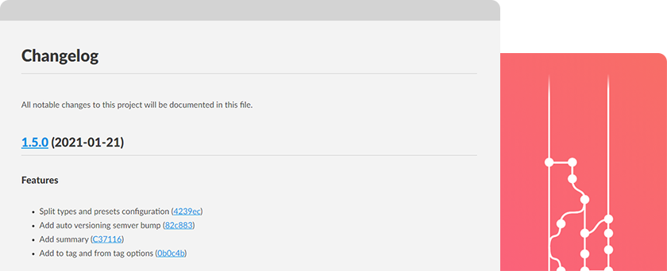

<div align="center">

<h1 align="center">PHP Conventional Changelog</h1>


[](https://conventionalcommits.org)

[](https://github.com/marcocesarato/php-conventional-changelog)

#### If this project helped you out, please support us with a star :star:

<br>



</div>

## Description

Generate changelogs from a project's commit messages and metadata using composer and automate versioning
with [semver](https://semver.org) and [conventional-commits](https://conventionalcommits.org).

This package can generate changelog and release notes from committing history. It provides a command that can be run
from the terminal, or using composer scripts, to generate a changelog file in markdown for the current project.

The command may take parameters that define the releases of the project that will be considered to extract the changes
from the git history to generate the file. The package uses a configuration system with that permit to customize the
settings you may want to have your desired changelog generated.

### How to contribute

Have an idea? Found a bug? Please raise to [ISSUES](https://github.com/marcocesarato/php-conventional-changelog/issues)
or [PULL REQUEST](https://github.com/marcocesarato/php-conventional-changelog/pulls). Contributions are welcome and are
greatly appreciated! Every little bit helps.

## 📖 Installation

You can install it easily with composer

`composer require --dev marcocesarato/php-conventional-changelog`

#### Scripts *(Optional)*

For easy use the changelog generator or release faster your new version you can add to your `composer.json` the scripts:

> **Notes:** you can customize it according to your needs

```
{
  ...
  "scripts": {
    "changelog": "conventional-changelog",
    "release": "conventional-changelog --commit",
    "release:patch": "conventional-changelog --patch --commit",
    "release:minor": "conventional-changelog --minor --commit",
    "release:major": "conventional-changelog --major --commit"
  },
  ...
}
```

Now you can just run `composer changelog` or `composer release` (the last one will autobump the version code and commit changes) to generate your changelog.

## 📘 Configuration

> **Notes:** this procedure is *optional* and permit to overwriting/merging the default settings

For customize settings you just needs to create a file named `.changelog` on the root of your project/on the working
dir or use the `--config` option to specify the location of your configuration file.

> **Notes:**<br>
> - When a setting on the configuration file is not necessary just omit it
> - The default ignored types are: `build`, `chore`, `ci`, `docs`, `perf`, `refactor`, `revert`, `style`, `test`
> - To allow all types just keep empty `types` and set empty `ignoreTypes`

You can have more info about reading the [config documentation](./docs/config.md).

## 💻 Usage

The changelog generator will generate a log of changes from the date of the last tag to the current date, and it will
put all commit logs in the latest version just created.


> **Notes:**<br>
> - Some of these options listed on examples could be used together at the same time (ex. `--first-release --commit`)
> - Auto bump of version code using the [Semantic Versioning](https://semver.org) (`MAJOR.MINOR.PATCH`) is enabled by default if not specified the release method.
>    - `MAJOR`: At least one breaking change.
>    - `MINOR`: At least one new feature.
>    - `PATCH`: Default
> - Use these options to specify the release method: `--major`, `--minor`, `--patch`, `--rc`, `--beta`, `--alpha`.

### Examples

#### First version

> **Notes:** use this option only if you don't need all history changes or is the first version, else run with `--history` option

To generate your changelog for the first version run:

```shell
php vendor/bin/conventional-changelog --first-release
```

#### New version

To generate your changelog *(without committing files)*

```shell
php vendor/bin/conventional-changelog
```

#### New release (with commit and tag)

To generate your changelog with auto commit and auto versioning tagging run:

```shell
php vendor/bin/conventional-changelog --commit
```

or to amend at an existing commit you can run:

```shell
php vendor/bin/conventional-changelog --amend
```

#### History

To generate your changelog with the entire history of changes of all releases

> **Warn:** this operation will overwrite the `CHANGELOG.md` file if it already exists

```shell
php vendor/bin/conventional-changelog --history
```

#### Date range

To generate your changelog from a specified date to another specified date

```shell
php vendor/bin/conventional-changelog --from-date="2020-12-01" --to-date="2021-01-01"
```

#### Tag range

To generate your changelog from a specified tag to another specified tag

```shell
php vendor/bin/conventional-changelog --from-tag="v1.0.2" --to-tag="1.0.4"
```

#### Specific version

To generate your changelog with a specific version code

```shell
php vendor/bin/conventional-changelog --ver="2.0.1"
```

### Commands List

> **Info:** You can have more info about running  `php vendor/bin/conventional-changelog --help`

```
        --config          str         Specify the configuration file path
-c      --commit          bool        Commit the new release once changelog is generated
        --commit-all      bool        Commit all changes the new release once changelog is generated
-a      --amend           bool        Amend commit the new release once changelog is generated
        --major           bool        Major release (important changes)
        --minor           bool        Minor release (add functionality)
        --patch           bool        Patch release (bug fixes) [default]
        --rc              bool        Release Candidate
        --beta            bool        Beta release
        --alpha           bool        Alpha release
        --first-release   bool        Run at first release (if --ver isn't specified version code will be 1.0.0)
        --to-date         str         Get commits from last tag date (or specified on --from-date) to specified date [YYYY-MM-DD]
        --from-date       str         Get commits from specified date [YYYY-MM-DD]
        --to-tag          str         Get commits from last tag (or specified on --from-tag) to specified tag
        --from-tag        str         Get commits from specified tag
        --ver             str         Specify the next release version code (semver)
        --history         bool        Generate the entire history of changes of all releases
        --no-verify       bool        Skip the pre-commit and commit-msg hooks
        --no-tag          bool        Disable release auto tagging when commit enabled
```